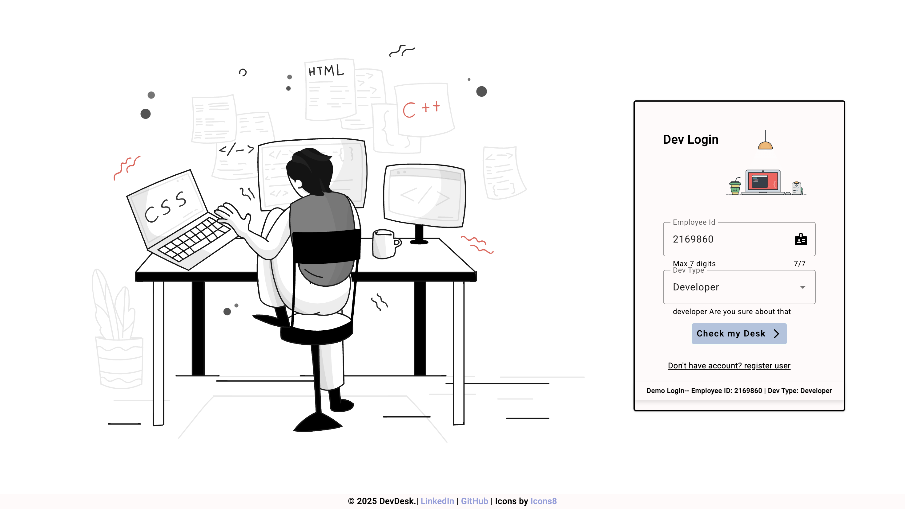
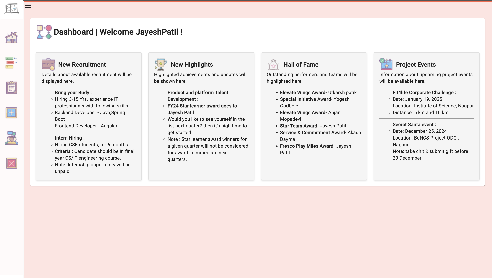
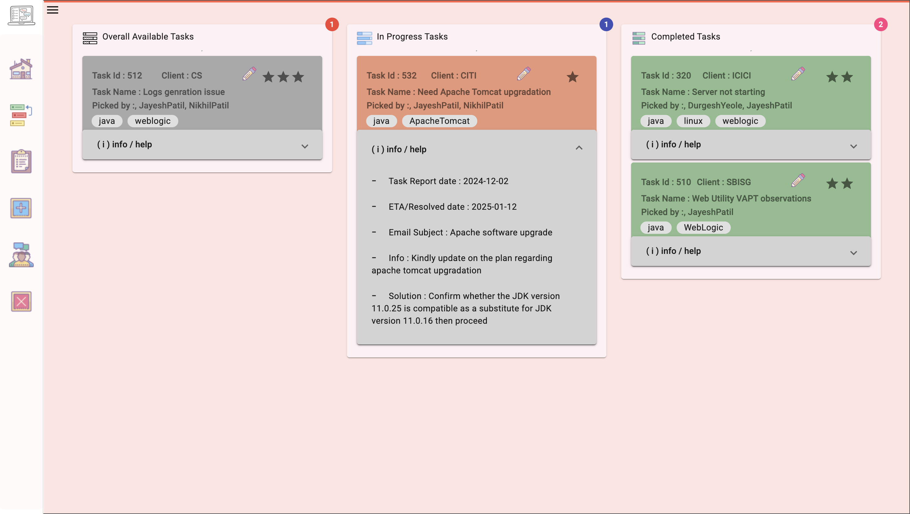
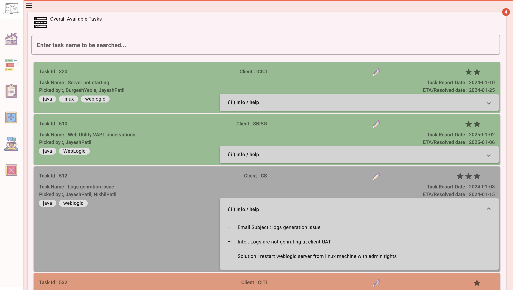
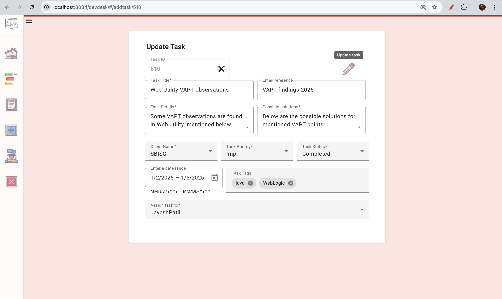

# devdesk
DevDesk is designed to streamline task management for developers, support teams, and business analysts.
It offers an intuitive UI, powerful tools, and seamless navigation to help teams stay organized and productive.

This repository serves as an index for DevDesk project's frontend and backend.

## 📢 Connect with Me  
[](https://www.linkedin.com/in/jayeshpatil665/)

DevDesk/<br>
├── frontend/ 🚀 **Frontend Repository:** [GitHub Link](https://github.com/jayeshpatil665/devdesk-frontend) <br>
├── backend/   🔥 **Backend Repository:** [GitHub Link](https://github.com/jayeshpatil665/devdesk-backend) <br>
├── README.md  (This file)<br>

## Demo
✨ **Live Demo:** [🔗 Visit Website](AWS EC2 instance URL - IP is keep changing)  

## 📸 **Screenshots**

🔐 Login Page  | <br>
🏠 Dashboard  |<br>
📊 My Tasks |<br>
📊 Overall Tasks |<br>
📊 Add/Edit Tasks |<br>


## How to Build the Project

1. Clone the frontend and backend repositories:
   ```bash
   git clone https://github.com/jayeshpatil665/devdesk-frontend.git
   git clone https://github.com/jayeshpatil665/devdesk-backend.git
   
2. Import FrontEndCode in VS Code and run below command to build.

ng build --configuration production --base-href /devdesk/

3. Import Backend Code in Spring Tool suite, show in Terminal and run below command to build.

mvn clean install
